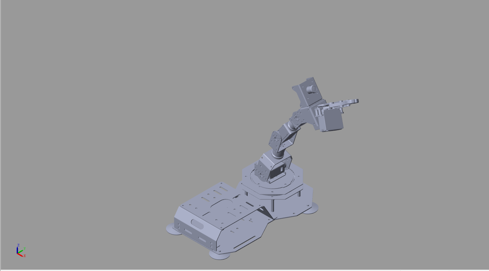
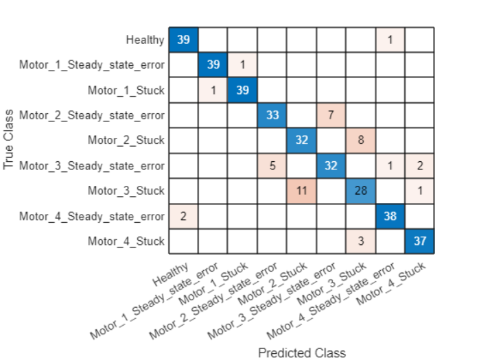
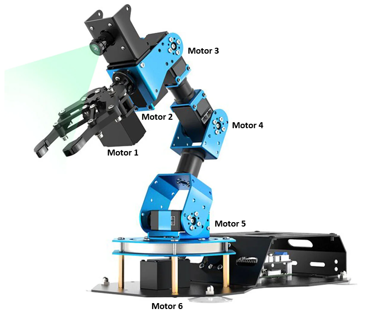
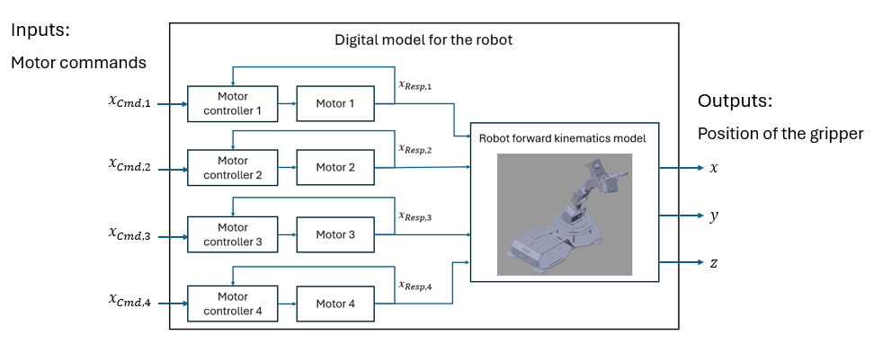

<!-- Improved compatibility of back to top link: See: https://github.com/othneildrew/Best-README-Template/pull/73 -->
<!-- ALL-CONTRIBUTORS-BADGE:START - Do not remove or modify this section -->
[](#contributors-)
<!-- ALL-CONTRIBUTORS-BADGE:END -->
<a id="readme-top"></a>
<!--
*** Thanks for checking out the Best-README-Template. If you have a suggestion
*** that would make this better, please fork the repo and create a pull request
*** or simply open an issue with the tag "enhancement".
*** Don't forget to give the project a star!
*** Thanks again! Now go create something AMAZING! :D
-->


<!-- PROJECT SHIELDS -->
<!--
*** I'm using markdown "reference style" links for readability.
*** Reference links are enclosed in brackets [ ] instead of parentheses ( ).
*** See the bottom of this document for the declaration of the reference variables
*** for contributors-url, forks-url, etc. This is an optional, concise syntax you may use.
*** https://www.markdownguide.org/basic-syntax/#reference-style-links
-->
[![Contributors][contributors-shield]][contributors-url]
[![Forks][forks-shield]][forks-url]
[![Stargazers][stars-shield]][stars-url]
[![Issues][issues-shield]][issues-url]
[![MIT License][license-shield]][license-url]
[![LinkedIn][linkedin-shield]][linkedin-url]


<!-- PROJECT LOGO -->
<br />
<div align="center">
  <a href="https://github.com/sonic160/dtr_digital_model_simulink">
    
    
  </a>

<h3 align="center"> Robot fault diagnosis with digital twins and artificial intelligence </h3>

  <p align="center">
     This repository presents a digital model of a robot, and use it to train an AI model for fault diagnosis. The performance of developed fault diagnosis algrorithm is tested on a real robot connected to its digital twin. This reposository is part of an open-source program of developing digital twins for predictive maintenance of robots.
    <br /> 
    <a href="https://github.com/sonic160/digital_twin_robot">Explore other repositories of the same program </a>
    <br />
    <br />
    <a href="https://github.com/sonic160/dtr_digital_model_simulink">View Demo</a>
    ·
    <a href="https://github.com/sonic160/dtr_digital_model_simulink/issues/new?labels=bug&template=bug-report---.md">Report Bug</a>
    ·
    <a href="https://github.com/sonic160/dtr_digital_model_simulink/issues/new?labels=enhancement&template=feature-request---.md">Request Feature</a>
  </p>
</div>


<!-- TABLE OF CONTENTS -->
<details>
  <summary>Table of Contents</summary>
  <ol>
    <li>
      <a href="#about-the-project">About The Project</a>
    </li>
    <li><a href="#structure-of-this-repository">Structure of this repository</a></li>
    <li>
      <a href="#getting-started">Getting Started</a>
    </li>
    <li><a href="#usage">Usage</a></li>
    <li><a href="#development-roadmap">Roadmap</a></li>
    <li><a href="#contributing">Contributing</a></li>
    <li><a href="#license">License</a></li>
    <li><a href="#contact">Contact</a></li>
    <li><a href="#acknowledgments">Acknowledgments</a></li>
  </ol>
</details>


<!-- ABOUT THE PROJECT -->
## About The Project

A digital model is a simulation model in the virtual space that is able to simulate the performance of a physical entity. It is the first step of constructing a digital twin model. 

In this repository, we develop a digital model for a [Hiwonder Armpi_FPV][armpi-fpv] robot. This robot has six degrees of freedom and has a gripper as end-effector. The main performance requirement during normal operation comes from the performance of controlling the end-effector (e.g., steady-state error, percentage overshoot, settling time). Therefore, the digital model here focuses on simulating the movement trajectory (in terms of 3-d coordinates x, y and z) of its end-effector given input control commands on the four motors (3-6). 



A schematic of the digital model is given below to highlight its composition and input-outputs. The digital model can be used to build a [digital shaddow][digital-shaddow-repository] and [digital twin][digital-twin-repository].



As a use case of this digital model, you will find a script and tutorial on how to use this digital model to generate simulated failure data to train a fault diagnosis model in the virtual space. Then, you will also find scripts and tutorials to run tests on a physical robot and collect data using the digital twin of it. The collected data are, then, used to evaluate the performance of the AI modeled trained by the simulation data.

<p align="right">(<a href="#readme-top">back to top</a>)</p>


<!-- STRUCTRUE OF THIS REPOSITORY -->
## Structure of this repository

In this repository, we have the following parts:
- `digital_model_complete`: This folder contains the digital models for different purposes.
    - The **`main_3_armpi_fpv.slx`** and **`subsystem.slx`** files contain the digital model of the arm control structure, the arm with command input itself respectively
    - **`subsystem.slx`** is designed to be used with the main file, and has been seperated for readability;
    - **`Robot_model.slx`** contains an arm without command features, used for kinematic computations. 
    - **`robot_model_visualization.slx`** contains an arm without command features but with visualization features. It is used to visualize the movement of the robot.
- `digital_model_kinematics`: This folder contains tutorials for creating a multibody tree model in Simulink from the URDF file of a robot, and running inverse and forward kinematics simulation in simulink. It is used for training purpose only.
- `scripts`: This folder contains scripts for running simulation on the digital model, and training and test the AI model for fault diagnosis.
  - `demoSingleSimulation.mlx`: This is a Matlab livescript showing how to run simulations on the digital model. It also shows how to inject failure on the digital model to generate training data for training the AI model for fault diagnosis.
  - `generateTrainingData.mlx`: This is a Matlab livescript showing how to generate training data for training the AI model for fault diagnosis. It is used to generate the training data used in the case study.
  - `trainOnSimulationData.mlx`: This is a Matlab livescript showing how to train the AI model for fault diagnosis on the simulation data, and test on simulation data through cross validation.
  - `trainSimTestReal.mlx`: This is a Matlab livescript that train a fault diagnosis model on the simulation data, and test on datasets collected from a real robot.
  - `DataLoader.m`: This is a Matlab function that defines a class for loading the data in the original formats and perform the necessary format transformation to prepare data for training and testing in Matlab.
  - `RobotSimulator.m`: This is a Matlab class that defines a class for running simulations on the digital model. It is used to run simulations on the digital model.
  - `TrajectoryGenerator.m`: This is a Matlab function that defines a class for generating trajectories for the robot. It is used to generate trajectories for the robot.

<p align="right">(<a href="#readme-top">back to top</a>)</p>

<!-- GETTING STARTED -->
## Getting Started

- Make sure the required dependencies are properly installed:
  - Matlab and Simulink R2023b or later.

- Clone this repository:
```
git clone https://github.com/sonic160/dtr_digital_model_simulink.git
```

- If you want to collect test data from the real robot:
  - Clone this [ropository][digital-shaddow-repository] and follow the setup requirements there.

<p align="right">(<a href="#readme-top">back to top</a>)</p>

<!-- USAGE EXAMPLES -->
## Usage

Here are some examples showing the most common usage of this repository:
- [A tutorial on how to build a multibody tree model in Simulink from the URDF file of a robot, and run inverse and forward kinematics simulation in simulink.][tutorial-multibody-tree]
- [How to use the `RobotSimulator` class to a simulation on the developed digital model.][tutorial-robot-simulation]
- [Generate training data for the fault diagnosis model using the digital twin.][tutorial-generate-training-data]
- [Train an AI model based on the simulated training data.][tutorial-train-on-simulation-data]
- Collect test data from real robot (to be completed).
- [Test the model trained on simulation data on test data collected from real the real robot.][tutorial-train-sim-test-real]

<p align="right">(<a href="#readme-top">back to top</a>)</p>


<!-- ROADMAP -->
## Development Roadmap

- [ ] Add measurement noise in the virtual sensor for measuring the position of the end-effector.
- [ ] Use a real accelerameter to measure the position of the end-effector. Use filtering algorithm to ensure accuracy.
- [ ] Improve the accuracy of the developed fault diagnosis algorithm on the real data.

See the [open issues](https://github.com/sonic160/dtr_digital_model_simulink/issues) for a full list of proposed features (and known issues).

<p align="right">(<a href="#readme-top">back to top</a>)</p>


<!-- CONTRIBUTING -->
## Contributing

Contributions are what make the open source community such an amazing place to learn, inspire, and create. Any contributions you make are **greatly appreciated**.

If you have a suggestion that would make this better, please fork the repo and create a pull request. You can also simply open an issue with the tag "enhancement".
Don't forget to give the project a star! Thanks again!

1. Fork the Project
2. Create your Feature Branch (`git checkout -b feature/AmazingFeature`)
3. Commit your Changes (`git commit -m 'Add some AmazingFeature'`)
4. Push to the Branch (`git push origin feature/AmazingFeature`)
5. Open a Pull Request

<p align="right">(<a href="#readme-top">back to top</a>)</p>


<!-- LICENSE -->
## License

Code and documentation copyright 2023- the authors. Code released and distributed under the MIT License. See `LICENSE.txt` for more information.

<p align="right">(<a href="#readme-top">back to top</a>)</p>


<!-- CONTACT -->
## Contact

Zhiguo Zeng - zhiguo.zeng@centralesupelec.fr


<p align="right">(<a href="#readme-top">back to top</a>)</p>


<!-- ACKNOWLEDGMENTS -->
## Acknowledgments

This work is partially supported by the French Research Council (ANR) JCJC projct Digital Failure Twin under contract number ANR-22-CE10-0004.

This project benifits from the following open source projects:
- To be updated.

<p align="right">(<a href="#readme-top">back to top</a>)</p>


<!-- MARKDOWN LINKS & IMAGES -->
<!-- https://www.markdownguide.org/basic-syntax/#reference-style-links -->

[contributors-shield]: https://img.shields.io/github/contributors/sonic160/dtr_digital_model_simulink.svg?style=for-the-badge
[contributors-url]: https://github.com/sonic160/dtr_digital_model_simulink/graphs/contributors
[forks-shield]: https://img.shields.io/github/forks/sonic160/dtr_digital_model_simulink.svg?style=for-the-badge
[forks-url]: https://github.com/sonic160/dtr_digital_model_simulink/network/members
[stars-shield]: https://img.shields.io/github/stars/sonic160/dtr_digital_model_simulink.svg?style=for-the-badge
[stars-url]: https://github.com/sonic160/dtr_digital_model_simulink/stargazers
[issues-shield]: https://img.shields.io/github/issues/sonic160/dtr_digital_model_simulink.svg?style=for-the-badge
[issues-url]: https://github.com/sonic160/dtr_digital_model_simulink/issues
[license-shield]: https://img.shields.io/github/license/sonic160/dtr_digital_model_simulink.svg?style=for-the-badge
[license-url]: https://github.com/sonic160/dtr_digital_model_simulink/blob/master/LICENSE.txt
[linkedin-shield]: https://img.shields.io/badge/-LinkedIn-black.svg?style=for-the-badge&logo=linkedin&colorB=555
[linkedin-url]: https://www.linkedin.com/in/zhiguo-zeng-%E6%9B%BE%E5%BF%97%E5%9B%BD%EF%BC%89-83411438/
[digital-shaddow-repository]: https://github.com/sonic160/dtr_robot_digital_shaddow
[digital-twin-repository]: https://github.com/sonic160/digital_twin_robot
[tutorial-multibody-tree]: docs/create_multibody_tree.md
[tutorial-robot-simulation]: docs/demoSingleSimulation.md
[armpi-fpv]: https://www.hiwonder.com/products/armpi-fpv?variant=39341129203799&srsltid=AfmBOop6vbvRGOxpcJ9fYdwK-CkRZYqJ7E9q5UzSxUSzi-xGNSe9NQmC
[tutorial-generate-training-data]: docs/generateTrainingData.md
[tutorial-train-on-simulation-data]: docs/trainOnSimulationData.md
[tutorial-train-sim-test-real]: docs/trainSimTestReal.md


## Contributors ✨

Thanks goes to these wonderful people ([emoji key](https://allcontributors.org/docs/en/emoji-key)):

<!-- ALL-CONTRIBUTORS-LIST:START - Do not remove or modify this section -->
<!-- prettier-ignore-start -->
<!-- markdownlint-disable -->
<table>
  <tbody>
    <tr>
      <td align="center" valign="top" width="14.28%"><a href="https://github.com/sonic160"><br /><sub><b>sonic160</b></sub></a><br /><a href="#projectManagement-sonic160" title="Project Management">📆</a> <a href="https://github.com/sonic160/dtr_digital_model_simulink/commits?author=sonic160" title="Code">💻</a></td>
    </tr>
  </tbody>
</table>

<!-- markdownlint-restore -->
<!-- prettier-ignore-end -->

<!-- ALL-CONTRIBUTORS-LIST:END -->

This project follows the [all-contributors](https://github.com/all-contributors/all-contributors) specification. Contributions of any kind welcome!