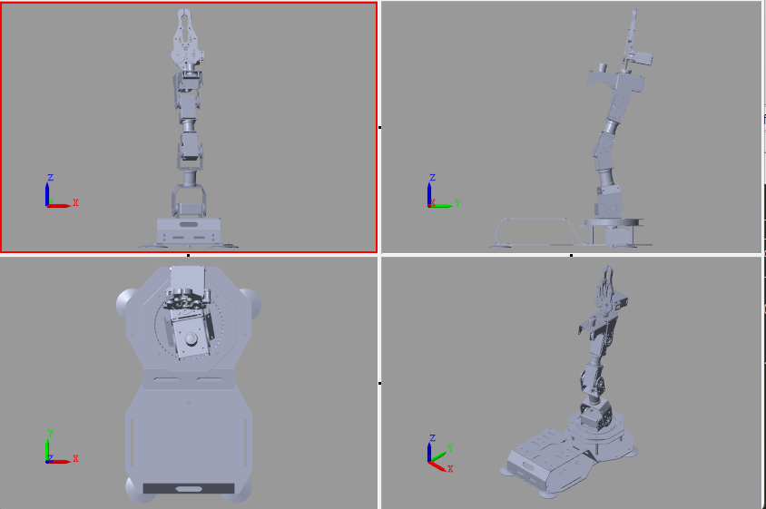
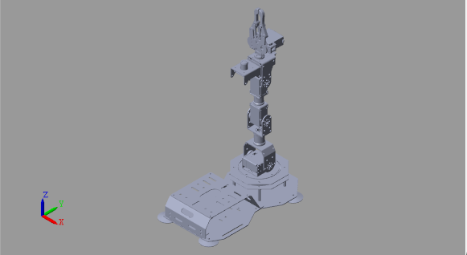
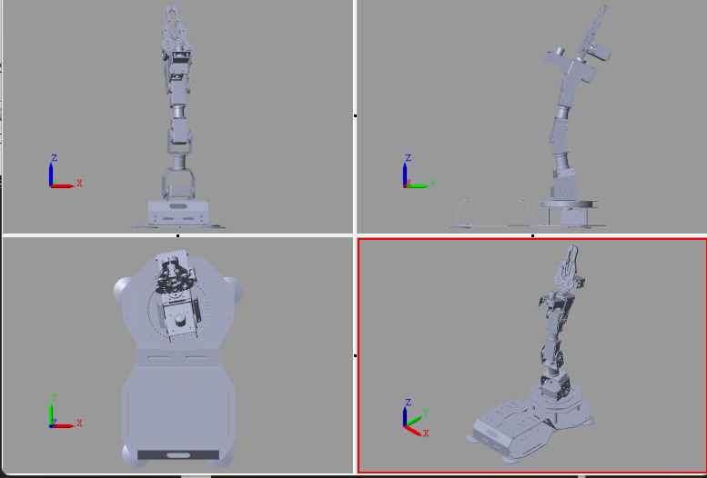

In Matlab, a multibody tree model is the basis for simulating robot kinematics and planning its trajectory. In [`digital_model_kinematics\armpi_fpv`](../digital_model_kinematics\armpi_fpv), we have the urdf files for the armpi_fpv robot used in this case study. Here, we show a quick tutorial on how to create a multibody tree model from the urdf file, and how to use the multibody tree model to run a forward and inverse kinematics simulation. If you are unfamiliar with urdf file, here is a very good [introcution](https://wiki.ros.org/urdf/Tutorials/Building%20a%20Visual%20Robot%20Model%20with%20URDF%20from%20Scratch).

## Create the multibody model from urdf

We can use `smimport` function to create a multibody model of our robot in simscape from its urdf file. The urdf file and its associated meshes are located in `digital_model_kinematics/armpi_fpv`. First, please set the current dictionary to be `digital_model_kinematics/`. Then, we can create a multibody model from the urdf file by running the following command.

```matlab:Code
clear; clc;

smimport('armpi_fpv/armpi_fpv.urdf')
```

After running this, a multibody model will be automatically generated. Here, we save it as [`digital_model_kinematics\armpi_fpv_step_1_direct_import.slx`](../digital_model_kinematics\armpi_fpv_step_1_direct_import.slx).

We can now simulate its behavior in simscape. 


You will see the robot move competely randomly. This is because we do not give any control signals to the joints. So they are moving randomly.

<video src="figures/armpi_fpv_step_1_direct_import.mp4" width="400" height="400" controls></video>

## Add input signals to the robot

In [`digital_model_kinematics\armpi_fpv_step_2_ideally_controlled.slx`](../digital_model_kinematics/armpi_fpv_step_2_ideally_controlled.slx), we add some simple controls to the robot. All the motors are fixed and only the gripper is commanded to move. It can be seen that the robot follows the command, although the gripper penetrates into itself. This is because we do not add physical constraints yet.

<video src="figures/armpi_fpv_step_2_ideally_controlled.mp4" width="600" controls></video>

## Forward and inverse kinematics

Once the multibody model is created, we can use it to solve forward and inverse kinematics. In robotics, forward kinematics is the process of determining the position and orientation of a robot's end effector given the joint angles. Inverse kinematics, on the other hand, is the process of determining the joint angles that will cause a robot to reach a desired end effector position and orientation.

In Matlab, we can define a `KinematicSolver` object from the multibody class to easily run forward and inverse kinematics simulation.

```Matlab
kine_solve = simscape.multibody.KinematicsSolver(mdl);
```

**In [`digital_model_kinematics\test_FK_IK.mlx`](../digital_model_kinematics/test_FK_IK.mlx), we present a livescript to show how to run forward and inverse kinematics simulation.**

### Forward kinematics

This example shows how to compute forward kinematics for the end effector of armpi_fpv. Specifically, it computes the position of the robot's gripper in terms of its $x,y,z$ coordinates. This example is constructed based on the [tutorial.](https://fr.mathworks.com/help/sm/ref/simscape.multibody.kinematicssolver.html)

  
1. Create a `KinematicsSolver` object for the robot

We first load the multibody simulation model of the robot and create a KinematicsSolver object.

```matlab:Code
clear; clc;

%% Import the model.
mdl = 'armpi_fpv_step_3_inverse_forward_kinematics';
load_system(mdl);
% Create a KinematicsSolver object.
kine_solve = simscape.multibody.KinematicsSolver(mdl);
```

2. Define frame variables

Now, `kine_solve` is defined as a kinematics solver that can solve the forward and inverse kinematics problem numerically. Forward kinematics solves a problem that knowing the states of joints, how to calculate the state of the end effector.

To solve this problem using the `KinematicsSolver` object, we need to first define the end effector and specify its coordination system is defined based on which frame. This relationship is encoded as frame variables in the `KinematicsSolver` object.

The following cell of code defines an end effector as "follower", and the reference cooridination system as "base". Both needs to be defined as a port in a frame of the multibody model.   

Here, we use "addFrameVariables" function to tell the `KinematicsSolver` object how do we define the end effector and what are the metrics we want for the end effector: "translation" indicates the position related to the base, while "rotation" indicates the degree of rotation with respect to the base.`

```matlab:Code
base = [mdl '/robot_armpi_fpv' '/World/W'];
follower = [mdl '/robot_armpi_fpv' '/gripper_base/F'];
addFrameVariables(kine_solve, "gripper_base", "translation", base, follower);
addFrameVariables(kine_solve, "gripper_base", "rotation", base, follower);
frameVariables(kine_solve)
```

| |ID|Base|Follower|Unit|
|:--:|:--:|:--:|:--:|:--:|
|1|"gripper_base.Transl...|"armpi_fpv_step_3_in...|"armpi_fpv_step_3_in...|"m"|
|2|"gripper_base.Transl...|"armpi_fpv_step_3_in...|"armpi_fpv_step_3_in...|"m"|
|3|"gripper_base.Transl...|"armpi_fpv_step_3_in...|"armpi_fpv_step_3_in...|"m"|
|4|"gripper_base.Rotati...|"armpi_fpv_step_3_in...|"armpi_fpv_step_3_in...|"deg"|
|5|"gripper_base.Rotati...|"armpi_fpv_step_3_in...|"armpi_fpv_step_3_in...|"deg"|
|6|"gripper_base.Rotati...|"armpi_fpv_step_3_in...|"armpi_fpv_step_3_in...|"deg"|

3. Define target variables

Target variables in the `KinematicsSolver` object defines what we know about the robot. In a forward kinematics problem, target variables are often the positions of the motors.  

To implement this, we need to get the IDs of motors:

```matlab:Code
jointPositionVariables(kine_solve)
```

| |ID|JointType|BlockPath|Unit|
|:--:|:--:|:--:|:--:|:--:|
|1|"j1.Rz.q"|"Revolute Joint"|"armpi_fpv_step_3_in...|"deg"|
|2|"j2.Rz.q"|"Revolute Joint"|"armpi_fpv_step_3_in...|"deg"|
|3|"j3.Rz.q"|"Revolute Joint"|"armpi_fpv_step_3_in...|"deg"|
|4|"j4.Rz.q"|"Revolute Joint"|"armpi_fpv_step_3_in...|"deg"|
|5|"j5.Rz.q"|"Revolute Joint"|"armpi_fpv_step_3_in...|"deg"|
|6|"j6.Rz.q"|"Revolute Joint"|"armpi_fpv_step_3_in...|"deg"|
|7|"j7.Rz.q"|"Revolute Joint"|"armpi_fpv_step_3_in...|"deg"|
|8|"j8.Rz.q"|"Revolute Joint"|"armpi_fpv_step_3_in...|"deg"|
|9|"j9.Rz.q"|"Revolute Joint"|"armpi_fpv_step_3_in...|"deg"|
|10|"j10.Rz.q"|"Revolute Joint"|"armpi_fpv_step_3_in...|"deg"|
|11|"j11.Rz.q"|"Revolute Joint"|"armpi_fpv_step_3_in...|"deg"|

Then, we can use "addTargetVariables" function to define the target variables using their IDs:

```matlab:Code
targetIDs = ["j1.Rz.q"; "j2.Rz.q"; "j3.Rz.q"; "j4.Rz.q"; "j5.Rz.q";];
addTargetVariables(kine_solve, targetIDs);
```

4. Define the output of the FK analysis

Finally, we just need to tell `KinematicsSolver` object what do we want it to calculate, i.e., the outputs. This is done by the "addOutputVariables" function. In this case, we would like to evaluate the $x,y,z$ coordinates of the gripper base frame.

```matlab:Code
outputIDs = ["gripper_base.Translation.x"; "gripper_base.Translation.y"; "gripper_base.Translation.z"];
addOutputVariables(kine_solve, outputIDs);
```

5. Calculate the positions of the end effector given inputs

First, let us try a simple case: if the five motors are in nominal positions with 0 degree of rotation, then, the robot should be in up-straight position.

```matlab:Code
targets = [0, 0, 0, 0, 0];
[outputVec, statusFlag] = solve(kine_solve,targets)
```

```text:Output
outputVec = 3x1    
    0.0000
   -0.0000
    0.3105

statusFlag = 1
```

```matlab:Code
% Visualize the result
viewSolution(kine_solve);
```


We can test a random combinations of the joints' states: [10, 10, 10, 10, 10]

```matlab:Code
targets = [10, 10, -30, 10, -10];
[outputVec, statusFlag] = solve(kine_solve, targets)
```

```text:Output
outputVec = 3x1    
   -0.0041
    0.0234
    0.3025

statusFlag = 1
```

```matlab:Code
% Visualize the result
viewSolution(kine_solve);
```



### Inverse kinematics

The analysis of inverse kinematics aims at calculating the positions of each motor, given the observed end effector positions. The process of applying inverse kinematics is the same as forward kinematics. We only need to switch the target and output variables.

```matlab:Code
clear; clc;

% Import the model.
mdl = 'armpi_fpv_step_1_direct_import';
load_system(mdl);
ik = simscape.multibody.KinematicsSolver(mdl);

% Define the base and follower frames.
base = 'armpi_fpv_step_1_direct_import/World/W';
follower = 'armpi_fpv_step_1_direct_import/gripper_base/F';
addFrameVariables(ik,"gripper_base", "translation", base, follower);
addFrameVariables(ik,"gripper_base", "rotation", base, follower);
frameVariables(ik)
```

| |ID|Base|Follower|Unit|
|:--:|:--:|:--:|:--:|:--:|
|1|"gripper_base.Transl...|"armpi_fpv_step_1_di...|"armpi_fpv_step_1_di...|"m"|
|2|"gripper_base.Transl...|"armpi_fpv_step_1_di...|"armpi_fpv_step_1_di...|"m"|
|3|"gripper_base.Transl...|"armpi_fpv_step_1_di...|"armpi_fpv_step_1_di...|"m"|
|4|"gripper_base.Rotati...|"armpi_fpv_step_1_di...|"armpi_fpv_step_1_di...|"deg"|
|5|"gripper_base.Rotati...|"armpi_fpv_step_1_di...|"armpi_fpv_step_1_di...|"deg"|
|6|"gripper_base.Rotati...|"armpi_fpv_step_1_di...|"armpi_fpv_step_1_di...|"deg"|

```matlab:Code
% Define the target variables.
targetIDs = ["gripper_base.Translation.x"; "gripper_base.Translation.y"; "gripper_base.Translation.z"];
addTargetVariables(ik, targetIDs);

% Define outputs
outputIDs = ["j1.Rz.q"; "j2.Rz.q"; "j3.Rz.q"; "j4.Rz.q"; "j5.Rz.q"];
addOutputVariables(ik,outputIDs);
```

## Test the inverse kinematics - I

Let us first try targets = [0, 0, 0.3105], which corresponds to the up-straight position. So the theoretical solutions should be [0, 0, 0, 0, 0].

```matlab:Code
targets = [0, 0, 0.3105]
```

```text:Output
targets = 1x3    
         0         0    0.3105

```

```matlab:Code
[outputVec,statusFlag] = solve(ik,targets)
```

```text:Output
outputVec = 5x1    
    0.0028
    0.3716
   -0.2662
   -1.0387
    0.0051

statusFlag = 1
```

```matlab:Code
viewSolution(ik);
```

We can see we have some small errors but it is tolerable. Below is the visulization result:



## Test the inverse kinematics - I

Let us first try targets = [-0.0041, 0.0234, 0.3025], which corresponds to the second test case of the forward kinematics. So the theoretical solutions should be [10, 10, -30, 10, -10].

```matlab:Code
targets = [-0.0041, 0.0234, 0.3025]
```

```text:Output
targets = 1x3    
   -0.0041    0.0234    0.3025

```

```matlab:Code
[outputVec,statusFlag] = solve(ik,targets)
```

```text:Output
outputVec = 5x1    
    9.9381
    9.5943
  -21.4248
  -12.7397
    0.0051

statusFlag = 1
```

```matlab:Code
viewSolution(ik);
```



We can see some errors. This could be caused by the fact that the problem of inverse kinematics is indetermint: Multiple solutions might lead to the same result. To improve the performance, we could try to give an initial guess of some values.

```matlab:Code
guessesIDs = ["j3.Rz.q","j4.Rz.q"];
guesses = [-35, 8];
addInitialGuessVariables(ik, guessesIDs);
[outputVec,statusFlag] = solve(ik,targets,guesses)
```

```text:Output
outputVec = 5x1    
    9.9381
    9.9907
  -30.0076
   10.0599
    0.0051

statusFlag = 1
```

Now the solution is much better. Note that the element in the solution is related to the rotation of joint 5, which does not affect the position of the end effector in the 3-d space. That it why its estimation is not accurate.

### Source code

The soure code for forward and inverse kinematics is availabe from
**[`digital_model_kinematics\test_FK_IK.mlx`](../digital_model_kinematics/test_FK_IK.mlx).**

