In this tutorial, we will demonstrate how to use the `RobotSimulator` class to simulate the movement of the robot and inject failures. And how to use `TrajectoryGenerator` class to generate random movement trajectories used in training the AI-based fault diagnosis model.

Here, we consider the digital model of the Armpi_FPV robot we developed in the previous [tutorial](create_multibody_tree.md). The goal of the simulation is to simulate the response trajectory of the end-effector given a set of control signals on the motor level, under both normal operation and different simulated failure conditions.

The source code used in this tutorial is available at **[`scripts\demoSingleSimulation.mlx`](../scripts/demoSingleSimulation.mlx).**

## Make a simulation using the `RobotSimulator` class: Basic usage

In this section, we show a simple demo on how to use `RobotSimulator` class to simulate the trajectory of the end-effecotr given a input command ($x, y, z$ coordinates over time). First, we need to define the control signals of the five motors. The control signals are defined as a timeseries object. Please note that:

   -  motor 1-5 here represents motor 6-2 in the real robot, respectively. The last motor is not considered as it controls the gripper and does not affect the movement of the end-effecotr. 
   -  The control command takes integral values in [0, 1000], which corresponds to [0, 240] degrees.  


In the example below, we simulate a simple movement of the robot. Running the script will give you four Figures. 

   -  The first one shows the command and response of each motor.  
   - The second one shows the residuals between motor commands and motor responses. Please note that both this Figure the the previous Figure will not be hided to the AI model, as the objective of the AI model is to diagnose motor-level faults by only observing the motor commands and the response trajectory of the end-effecotr.
   -  The third and forth ones shows the command and response of the trajectory of the end-effector. 
   -  Additionally, you will see an animation of the robot movement. 

```matlab:Code
clear; clc; close all;

% Define the length of simulation and the corresponding sequence length.
lenSeries = 1000; % Sequence length.
simulationTime = 10; % The time that this sequence corresponds to.

% Instantiate a RobotSimulator class.
robotSimulator = RobotSimulator(lenSeries, simulationTime);

% Prepare the control commands.
% Let motor 1-5 to move from 500 to 1000 in 10 seconds, respectively.
motorCmds = cell(1, 5);
for i = 1:5
    if i == 1
        motorCmds{i} = timeseries(transpose(linspace(500, 1000, lenSeries)), robotSimulator.simulationTimeStamps);
    else
        motorCmds{i} = timeseries(transpose(linspace(500, 600, lenSeries)), robotSimulator.simulationTimeStamps);
    end
end

% Run a simulation and show the results.
failureType = 0;
robotSimulator.runSimulation(motorCmds, failureType);
```

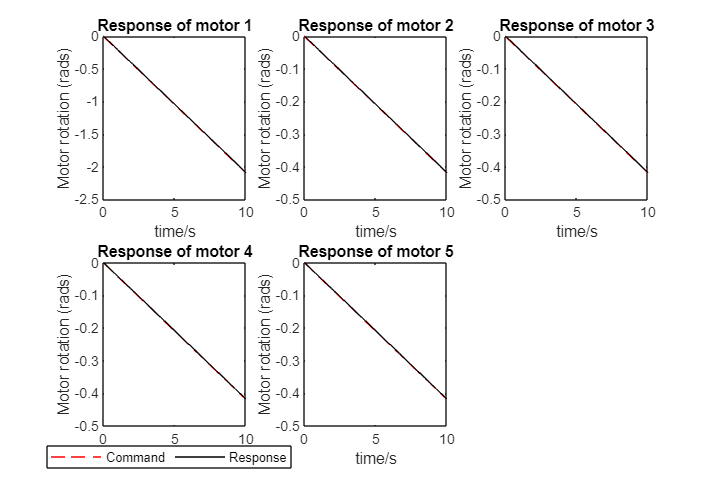

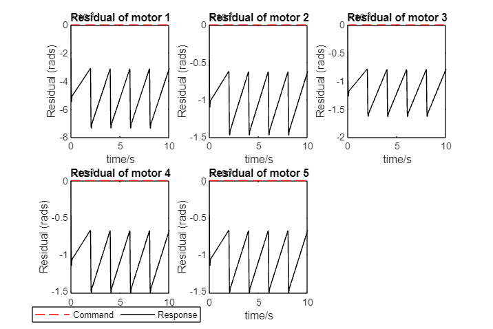


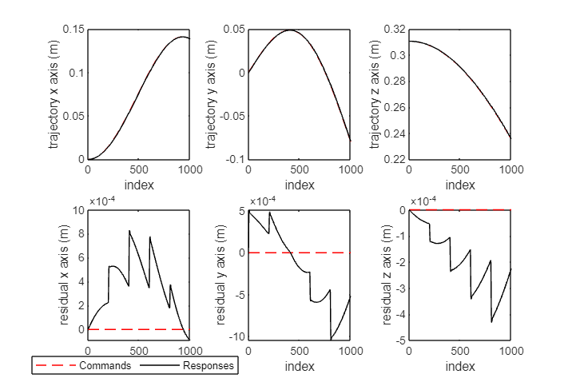

<video src="figures/robot_simulation_no_failure.mp4" width="600" controls></video>

## Simulate motor errors due to position sensor accuracy

In the real robot, due to the limitation of the accuracy of position sensors, each motor has some small errors even when no failure is presented. To simulate this, we assume that the motor shows a constant steady-state error every errorBlockSize points. During this period, the error follows a discrete distribution described by errorValues and its probabilities errorProb.

Below is an example of considering the motor accuracy in the simulation. By changing the values of the three parameters, we can simulate different degrees of motor inaccuracy.

```matlab:Code
robotSimulator.errorBlockSize = 200; % The length of a error. The same error will persists for errorBlockSize points.
robotSimulator.errorValues = [-3, -2, -1, 0, 1, 2, 3]; % The possible errors on the positions, in robot control unit.
robotSimulator.errorProb = [.05, .1, .2, .3, .2, .1, .05]; % Probability distribution of different errors.

% Run a simulation and show the results.
failureType = 0;
robotSimulator.runSimulation(motorCmds, failureType);
```

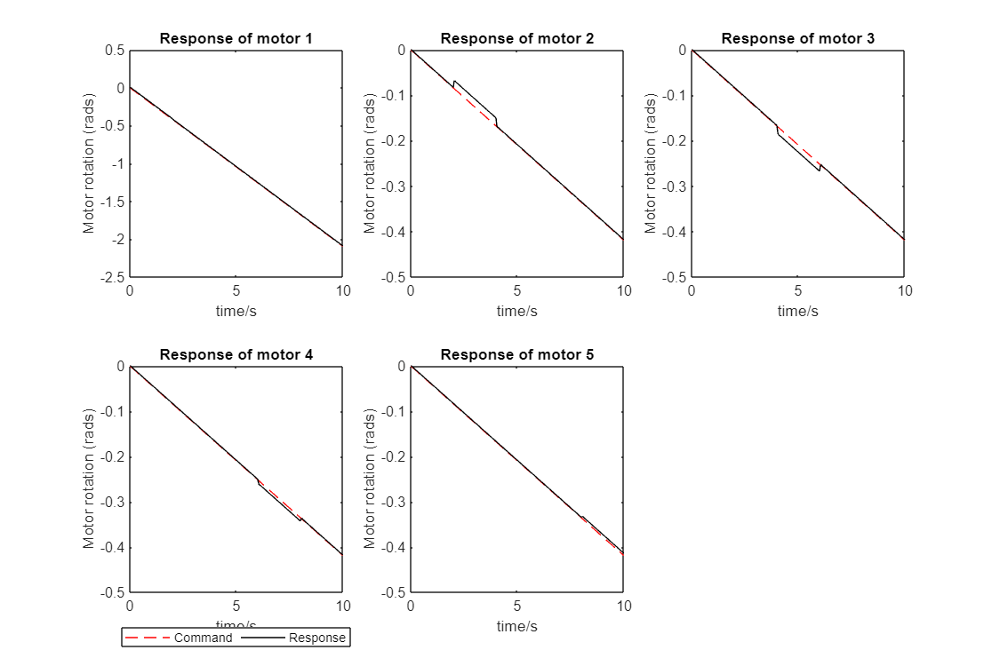

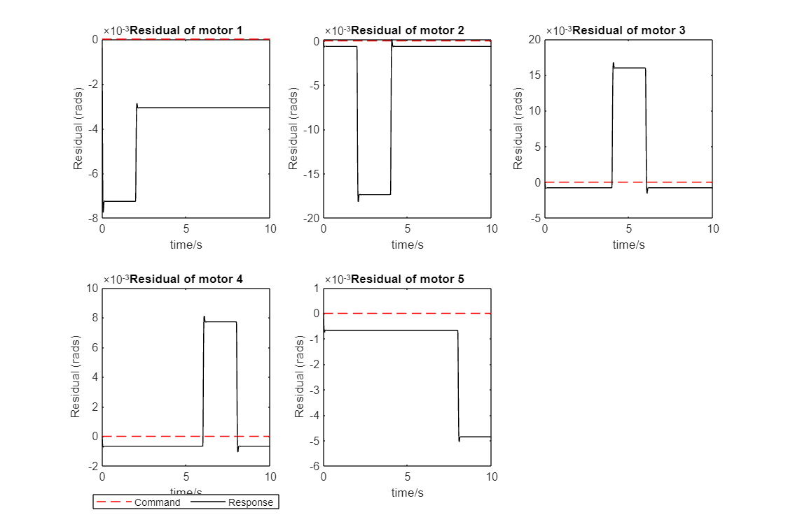

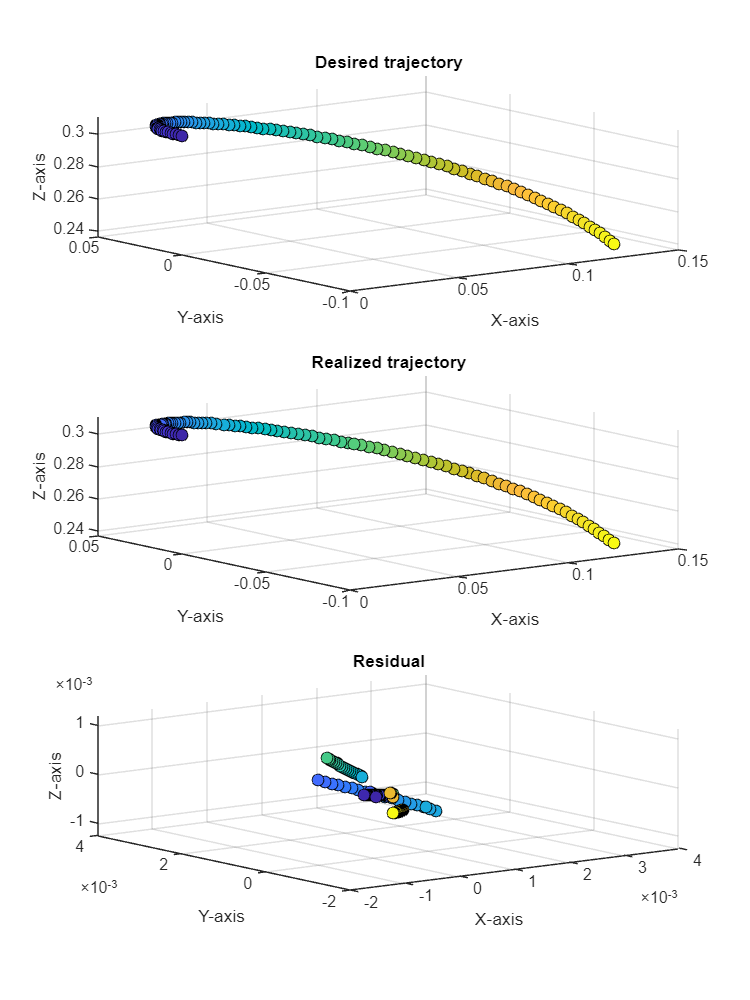

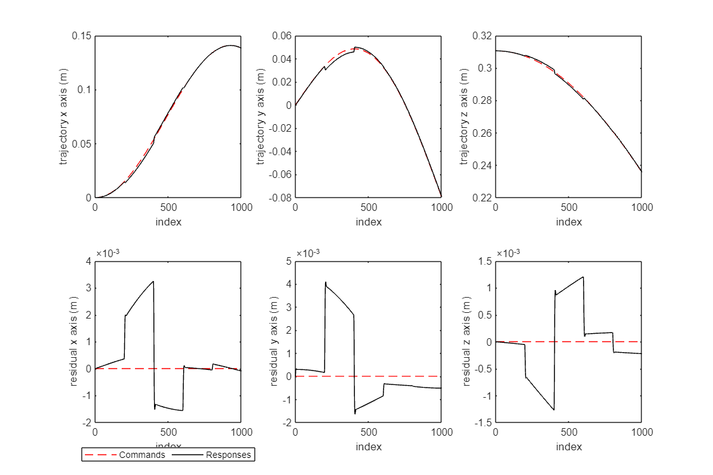

## Use `TrajectoryGenerator` class to generate a trajectory for simulation

We defined a class called `TrajectoryGenerator` that allows generating different types of trajectories easily. Below, you will find a demo on how to use this class to generate a random move trajectory. Then same type of trajectory will be used to generate test data on the real robot.

```matlab:Code
clear; clc; close all;

% Define the length of simulation and the corresponding sequence length.
lenSeries = 1000; % Sequence length.
simulationTime = 10; % The time that this sequence corresponds to.

% Instantiate a RobotSimulator class.
robotSimulator = RobotSimulator(lenSeries, simulationTime);

% Instantiate a TrajectoryGenerator class.
trajGenerator = TrajectoryGenerator(lenSeries, simulationTime);

% Generate a random trajectory.
trajGenerator.trajType = 'random_move';
nTraj = 1; 
motorCmdsList = trajGenerator.generateTrajectories(nTraj);

% Get the first motorCmds for simulation.
motorCmds = motorCmdsList{1};
% Run a simulation and show the results.
robotSimulator.errorBlockSize = 200; % The length of a error. The same error will persists for errorBlockSize points.
robotSimulator.errorValues = -5:5; % The possible errors on the positions, in robot control unit.
robotSimulator.errorProb = [.07, .07, .07, .07, .07, .3, .07, .07, .07, .07, .07]; % Probability distribution of different errors.
failureType = 0;
robotSimulator.runSimulation(motorCmds, failureType);
```


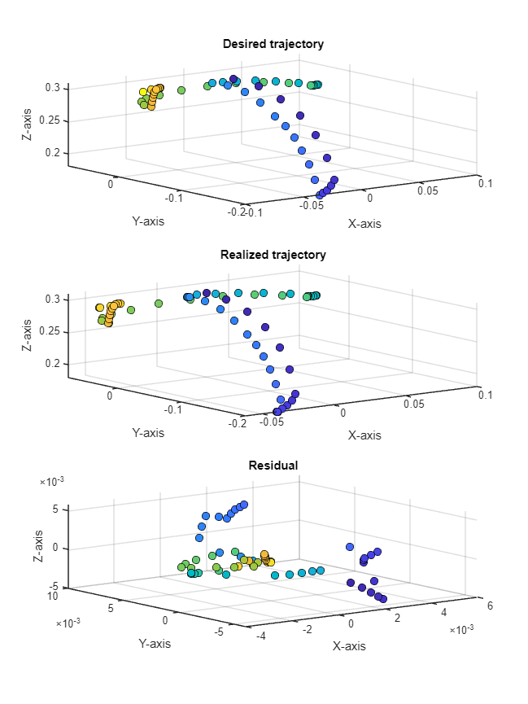

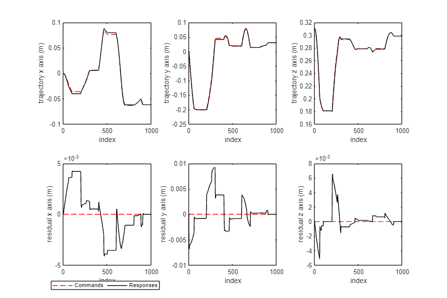

## Simulate stuck failure

Setting variable `failure_type` from $0$ to $1,\cdots ,5$ simulate the stuck failure of motor $1$ to motor $5$, respectivley. You can experiment and see the difference in the realized trajectory. Below, we show a demo of simulating a stuck failure of motor 1.

```matlab:Code
clear; clc; close all;

% Define the length of simulation and the corresponding sequence length.
lenSeries = 1000; % Sequence length.
simulationTime = 10; % The time that this sequence corresponds to.

% Instantiate a RobotSimulator class.
robotSimulator = RobotSimulator(lenSeries, simulationTime);

% Instantiate a TrajectoryGenerator class.
trajGenerator = TrajectoryGenerator(lenSeries, simulationTime);

% Generate a random trajectory.
trajGenerator.trajType = 'random_move';
nTraj = 1; 
motorCmdsList = trajGenerator.generateTrajectories(nTraj);

% Get the first motorCmds for simulation.
motorCmds = motorCmdsList{1};
% Run a simulation and show the results.
robotSimulator.errorBlockSize = 200; % The length of a error. The same error will persists for errorBlockSize points.
robotSimulator.errorValues = -5:5; % The possible errors on the positions, in robot control unit.
robotSimulator.errorProb = [.07, .07, .07, .07, .07, .3, .07, .07, .07, .07, .07]; % Probability distribution of different errors.
failureType = 1; % Motor 1 stuck.
robotSimulator.stuckInstantIdx = 50;
robotSimulator.runSimulation(motorCmds, failureType);
```

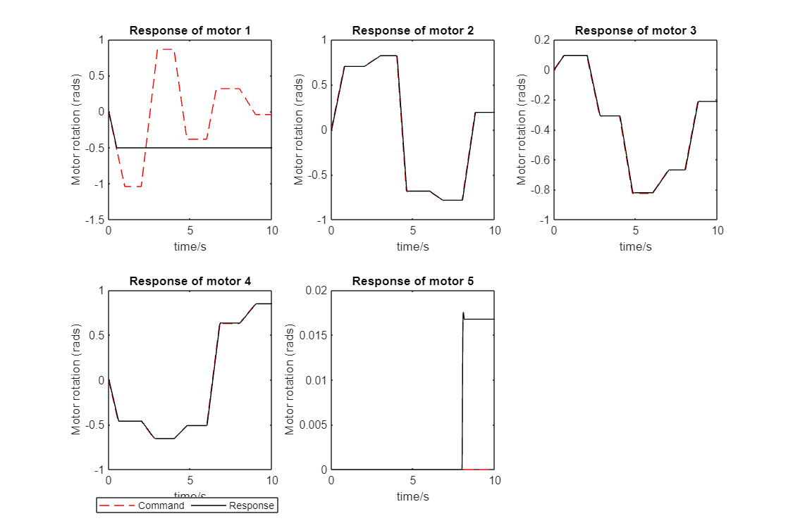

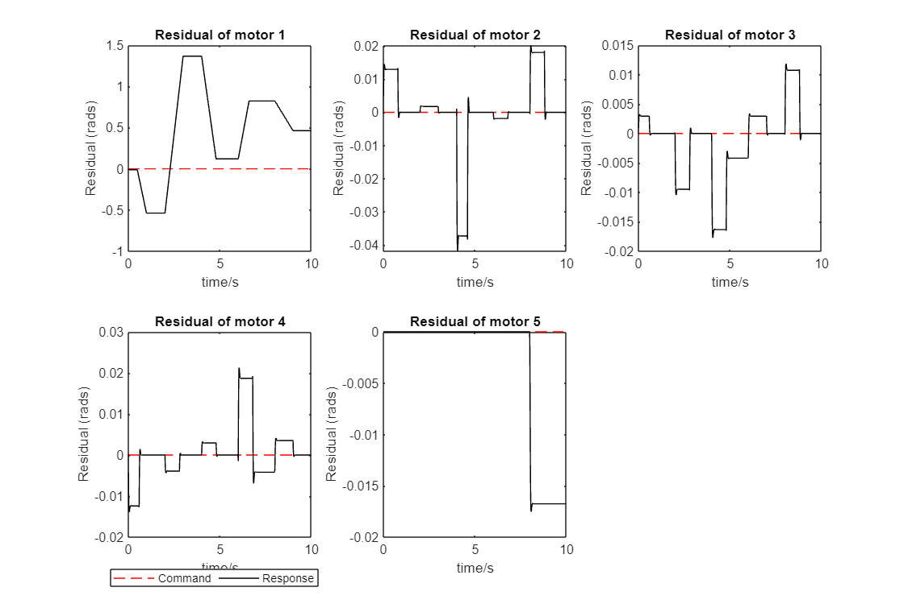

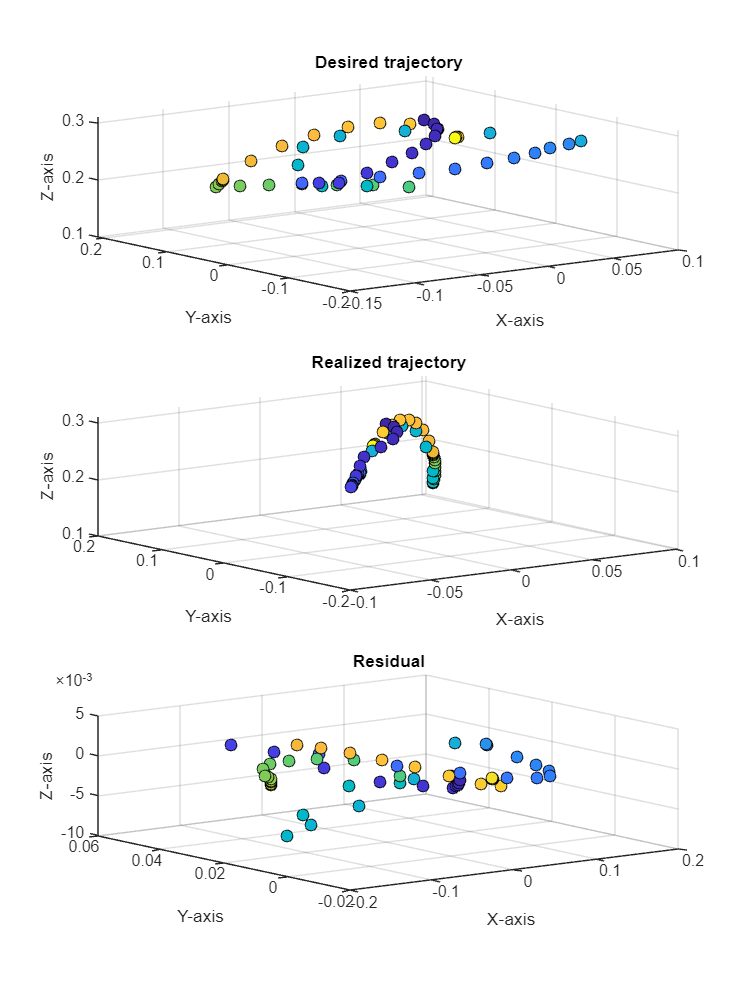

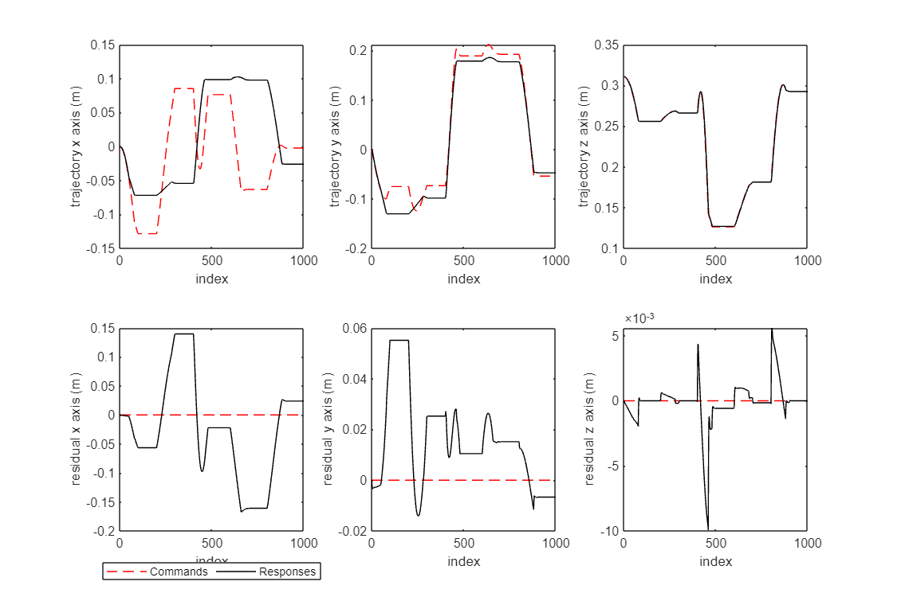


## Simulate steady-state error

Below, we show a code to simulate a random movement, with a steady-state error on motor 1.

```matlab:Code
clear; clc; close all;

% Define the length of simulation and the corresponding sequence length.
lenSeries = 1000; % Sequence length.
simulationTime = 10; % The time that this sequence corresponds to.

% Instantiate a RobotSimulator class.
robotSimulator = RobotSimulator(lenSeries, simulationTime);

% Instantiate a TrajectoryGenerator class.
trajGenerator = TrajectoryGenerator(lenSeries, simulationTime);

% Generate a random trajectory.
trajGenerator.trajType = 'random_move';
nTraj = 1; 
motorCmdsList = trajGenerator.generateTrajectories(nTraj);

% Get the first motorCmds for simulation.
motorCmds = motorCmdsList{1};
% Run a simulation and show the results.
robotSimulator.errorBlockSize = 200; % The length of a error. The same error will persists for errorBlockSize points.
robotSimulator.errorValues = -5:5; % The possible errors on the positions, in robot control unit.
robotSimulator.errorProb = [.07, .07, .07, .07, .07, .3, .07, .07, .07, .07, .07]; % Probability distribution of different errors.
failureType = 5; % Motor 1 Steady-state error.
robotSimulator.error_ll = 10;
robotSimulator.error_ul = 50;
robotSimulator.runSimulation(motorCmds, failureType);
```

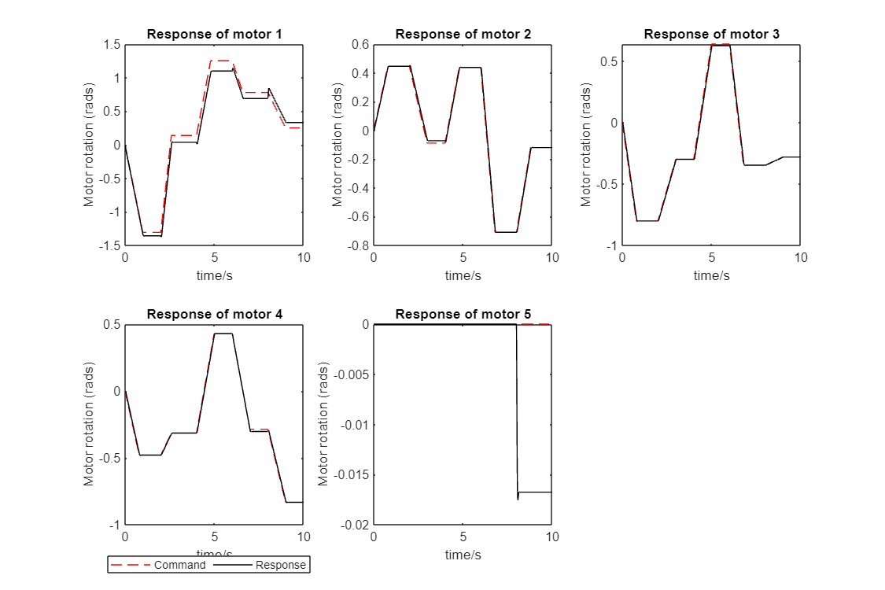


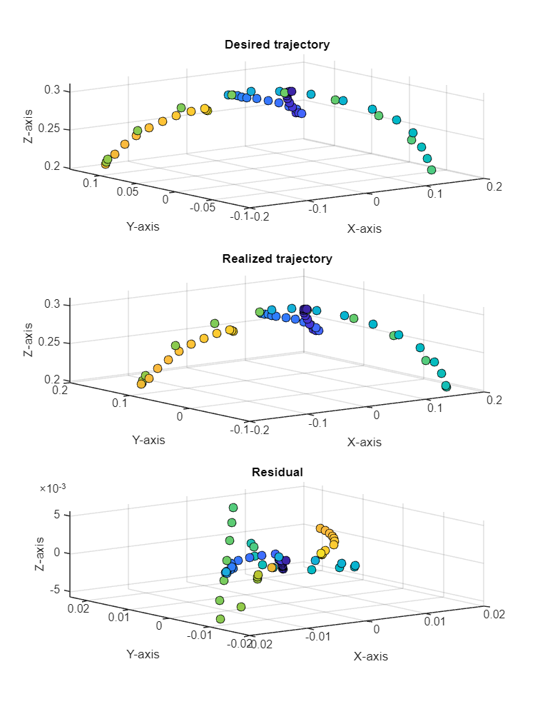

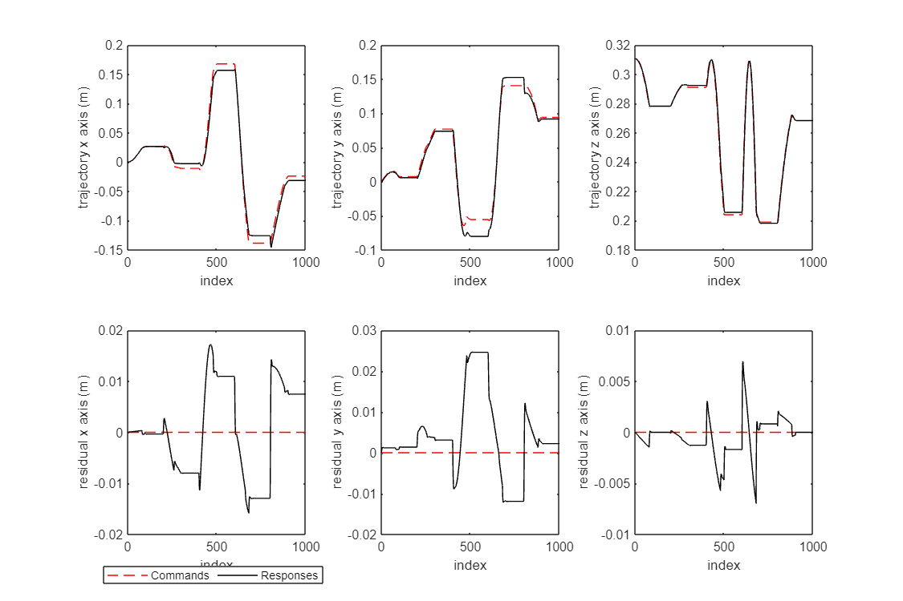
