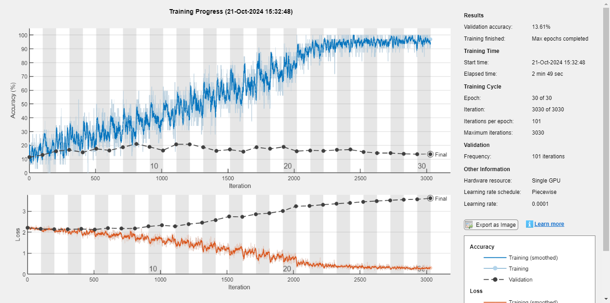
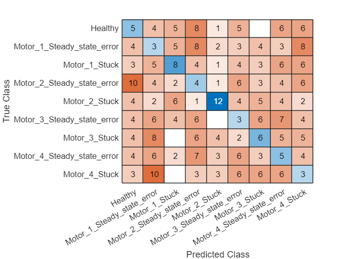
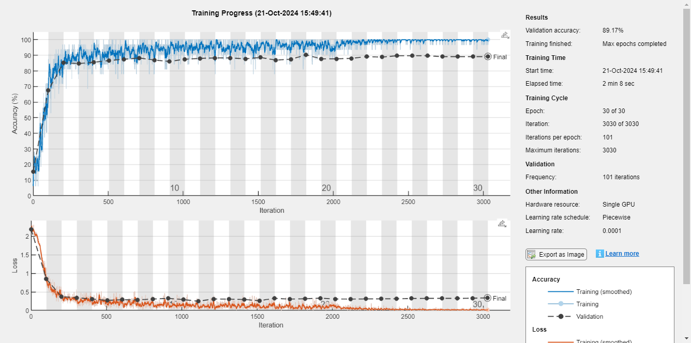
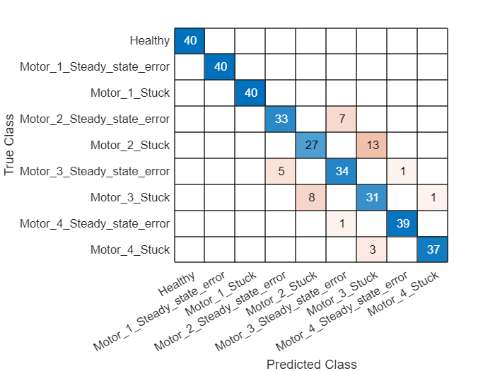

In this tutorial, we train an LSTM model based on the generated training dataset. The performance of the trained model is evaluated on the simulation dataset through a cross-validation. We compare two scenarios in this study:
1. Use only the directly observed features, i.e., the commands on motors $1$-$4$ and the measured trajectory of the end-effecotor ($x, y, z$ coordinates).
2. Use the digital twin model to derive auxilary features: The desired trajectory of the end-effector ($x, y, z$ coordinates) and the residuals of the end-effector on $x, y, z$ axes.

The results show that using digital twins to complement features can significantly improve the performance of the fault diagnosis model.

**You can run this example directly from this [source code](../scripts/trainOnSimulationData.mlx).**

## Download the dataset

First, we download previously generated training (through simulation) and test (from a real robot) dataset. The dataset should be first downloaded and unzipped into a local subdirectory called `dataset`. In `dataset/`, you will find three subfolders:

   -  trainingDatasets: Contain the training data; 
   -  testDatasetsOriginal: Contain the test data in the original format collected from the robot 
   -  testDatasets: Contain the test data transformed into the Matlab format. 
   -  dataset_descrpitions.txt: Describe the settings for generating each training and test dataset. 

You can either download the dataset from [this link](http://%27https//nextcloud.centralesupelec.fr/s/7AR6aamBZNXcRM8/download'). Then, you should unzip the downloaded file and put the folder `dataset` under the root dictionary. Or you can directly run this code to download the dataset. Depending on the network condition, it migth take up to 20 mins to download the dataset.

```matlab:Code
url = 'https://nextcloud.centralesupelec.fr/s/7AR6aamBZNXcRM8/download';
downloadFolder = fullfile('../', 'dataset');
rootDict = fullfile('../');
if ~exist(downloadFolder, 'dir')
    options = weboptions('Timeout', 30);
    loc = websave([downloadFolder '.zip'], url, options);
    unzip(loc, rootDict);
end
```

## Data preparation
### Load the training data

In this study, we train and test a fault diagnosis model both using the simulated failure data. First, we load the original training dataset, and create two cell arrays:

   -  dataTables: A cellarray of 3600 elements, each element is a dataTable, contains all the available features. 
   -  y: A cellarray of 3600 elements, each element is the label (str). 

```matlab:Code
clear; clc; close all;
warning('off');

% Set random seed for reproduction purpose.
rng(10);

doTraining = true;
trainingDataFolderName = '20241017';

% File to save the trained model.
mdlName = ['mdlMotorCmdsTrajResps' 'TrData' trainingDataFolderName 'TestDataSim' '.mat'];

% Define the path to check for 'conc_dataset.mat'
pathLoggedTrainingData = ['../dataset/trainingDatasets/' trainingDataFolderName '/training_dataset.mat'];
pathTrainingData = ['../dataset/trainingDatasets/' trainingDataFolderName '/'];

% Define a DataLoader instance.
% Define the length of simulation and the corresponding sequence length.
lenSeries = 1000; % Sequence length.
simulationTime = 10; % The time that this sequence corresponds to.
dataLoader = DataLoader(lenSeries, simulationTime);
dataLoader.pathTrainingDataset = pathTrainingData;
dataLoader.pathLoggedTrainingData = pathLoggedTrainingData;
[dataTables, y] = dataLoader.loadTrainingData();
```

```text:Output
Loaded data from ../dataset/trainingDatasets/20241017/training_dataset.mat
```

We can print an example of all the features. It should be noted that the features Motor1Cmd - Motor5Cmd and RealizedTrajectory-x, RealizedTrajectory-y and RealizedTrajectory-z are original data directly observed. The features DesiredTrajectory-x, y, z are auxilarry features calculated based on a digital twin simulation using Motor1Cmd - Motor5Cmd.

```matlab:Code
dataTables{1}
```

| |Timestamps|Motor1Cmd|Motor2Cmd|Motor3Cmd|Motor4Cmd|Motor5Cmd|DesiredTrajectory-x|DesiredTrajectory-y|DesiredTrajectory-z|RealizedTrajectory-x|RealizedTrajectory-y|RealizedTrajectory-z|matFilePath|
|:--:|:--:|:--:|:--:|:--:|:--:|:--:|:--:|:--:|:--:|:--:|:--:|:--:|:--:|
|1|0|0|0|0|0|0|0|-0|0.3105|0|-0|0.3105|'..\\dataset\\traini...|
|2|0.0100|0.0168|-0.0141|-0.0001|-0.0006|0|-0.0001|0.0035|0.3105|-0|0.0001|0.3105|'..\\dataset\\traini...|
|3|0.0200|0.0336|-0.0282|-0.0002|-0.0013|0|-0.0002|0.0070|0.3104|-0|0.0010|0.3105|'..\\dataset\\traini...|
|4|0.0300|0.0504|-0.0423|-0.0003|-0.0019|0|-0.0005|0.0105|0.3103|-0|0.0027|0.3105|'..\\dataset\\traini...|
|5|0.0400|0.0672|-0.0564|-0.0004|-0.0026|0|-0.0009|0.0140|0.3101|-0.0001|0.0053|0.3105|'..\\dataset\\traini...|
|6|0.0500|0.0840|-0.0705|-0.0005|-0.0032|0|-0.0015|0.0175|0.3099|-0.0003|0.0084|0.3104|'..\\dataset\\traini...|
|7|0.0600|0.1008|-0.0845|-0.0006|-0.0039|0|-0.0021|0.0209|0.3096|-0.0007|0.0119|0.3102|'..\\dataset\\traini...|
|8|0.0700|0.1176|-0.0986|-0.0006|-0.0045|0|-0.0029|0.0244|0.3093|-0.0012|0.0156|0.3100|'..\\dataset\\traini...|
|9|0.0800|0.1344|-0.1127|-0.0007|-0.0052|0|-0.0038|0.0278|0.3089|-0.0018|0.0193|0.3097|'..\\dataset\\traini...|
|10|0.0900|0.1512|-0.1268|-0.0008|-0.0058|0|-0.0047|0.0312|0.3085|-0.0025|0.0230|0.3094|'..\\dataset\\traini...|
|11|0.1000|0.1680|-0.1409|-0.0009|-0.0064|0|-0.0058|0.0345|0.3080|-0.0034|0.0266|0.3090|'..\\dataset\\traini...|
|12|0.1100|0.1848|-0.1550|-0.0010|-0.0071|0|-0.0071|0.0378|0.3075|-0.0044|0.0301|0.3086|'..\\dataset\\traini...|
|13|0.1200|0.2015|-0.1691|-0.0011|-0.0077|0|-0.0084|0.0411|0.3069|-0.0055|0.0335|0.3082|'..\\dataset\\traini...|
|14|0.1300|0.2183|-0.1832|-0.0012|-0.0084|0|-0.0098|0.0443|0.3063|-0.0067|0.0369|0.3076|'..\\dataset\\traini...|

## Training and validation set creation

We randomly split a dataset and train a LSTM.

```matlab:Code
% Shuffle the dataset using the cvpartition function
training_ratio = .9;
n_dataset = numel(dataTables);
training_size = floor(training_ratio*n_dataset);
cvObj = cvpartition(y, 'HoldOut', training_size);
idx = cvObj.test;

% Split into training and test data based on training size specified
dataTables_X_train = dataTables(idx');
dataTables_X_test = dataTables(~idx');
y_train = categorical(y(idx'));
y_test = categorical(y(~idx'));
```

We can show the distribution of classes in the training and testing dataset, to make sure the seperation is fair.

```matlab:Code
summary(y_train);
```

```text:Output
     Healthy      Motor_1_Steady_state_error      Motor_1_Stuck      Motor_2_Steady_state_error      Motor_2_Stuck      Motor_3_Steady_state_error      Motor_3_Stuck      Motor_4_Steady_state_error      Motor_4_Stuck 
     360          360                             360                360                             360                360                             360                360                             360           
```

```matlab:Code
summary(y_test);
```

```text:Output
     Healthy      Motor_1_Steady_state_error      Motor_1_Stuck      Motor_2_Steady_state_error      Motor_2_Stuck      Motor_3_Steady_state_error      Motor_3_Stuck      Motor_4_Steady_state_error      Motor_4_Stuck 
     40           40                              40                 40                              40                 40                              40                 40                              40            
```

## Pre-processing and feature engineering

First, we try to use only the directly observed features, i.e., the motor commands, and the observed end-effector trajectory (x, y, z). We standardize each feature for better training performance.

```matlab:Code
X_train = dataLoader.extractFeaturesOriginal(dataTables_X_train);
X_test = dataLoader.extractFeaturesOriginal(dataTables_X_test);

[X_train, M, S] = normalize_features(X_train);
[X_test, ~, ~] = normalize_features(X_test, M, S);
```

## Training and evaluating the model

Use an LSTM network. An LSTM layer learns long-term dependencies between time steps of time series or sequence data. The first lstmlayer will have 100 hidden units and output the sequence data. Then a dropout layer will be used to reduce probability of overfitting. The second lstmlayer will output just the last step of the time sequence.

```matlab:Code
layers = [ ...
    sequenceInputLayer(size(X_train{1},1))
    lstmLayer(100,"OutputMode","sequence")
    dropoutLayer(0.1)
    lstmLayer(100,"OutputMode","last")
    fullyConnectedLayer(numel(categories(y_train)))
    softmaxLayer
    classificationLayer];
```

### Define Network Hyperparameters

```matlab:Code
miniBatchSize = 32;
validationFrequency = floor(numel(X_train)/miniBatchSize);
options = trainingOptions("adam", ...
    "MaxEpochs",30, ...
    "MiniBatchSize",miniBatchSize, ...
    "Plots","training-progress", ...
    "Verbose",false, ...
    "Shuffle","every-epoch", ...
    "LearnRateSchedule","piecewise", ...
    "LearnRateDropFactor",0.1, ...
    "LearnRateDropPeriod",20,...
    'ValidationData',{X_test, y_test}, ...
    'ValidationFrequency',validationFrequency);
```

### Train The Network

This network takes about 100 seconds to train on an NVIDIA RTX 2080 GPU.

```matlab:Code
if doTraining
    diagnosisNet = trainNetwork(X_train, y_train, layers, options);
    save(mdlName, 'diagnosisNet');
else
    load(mdlName, 'diagnosisNet');
end
```



### Test The Network

Now that the network has been trained, we can test it on the validation data. 

```matlab:Code
y_pred = classify(diagnosisNet, X_test);
```

View the confusion chart for the test results:

```matlab:Code
cm = confusionchart(y_test', y_pred);
```



View the overall accuracy percentage of the validation and test results:

```matlab:Code
[accuracy, precision, recall, f1Score] = dataLoader.evalPerf(y_test, y_pred);
% Display the results
fprintf('Overall Accuracy: %.2f%%\n', accuracy * 100);
```

```text:Output
Overall Accuracy: 13.61%
```

```matlab:Code
class_names = categories(y_test);
for i = 1:numel(class_names)
    fprintf('Class %d (%s): Precision = %.2f, Recall = %.2f, F1 Score = %.2f\n', i, class_names{i}, precision(i), recall(i), f1Score(i));
end
```

```text:Output
Class 1 (Healthy): Precision = 0.12, Recall = 0.12, F1 Score = 0.12
Class 2 (Motor_1_Steady_state_error): Precision = 0.06, Recall = 0.07, F1 Score = 0.07
Class 3 (Motor_1_Stuck): Precision = 0.25, Recall = 0.20, F1 Score = 0.22
Class 4 (Motor_2_Steady_state_error): Precision = 0.09, Recall = 0.10, F1 Score = 0.09
Class 5 (Motor_2_Stuck): Precision = 0.44, Recall = 0.30, F1 Score = 0.36
Class 6 (Motor_3_Steady_state_error): Precision = 0.08, Recall = 0.07, F1 Score = 0.08
Class 7 (Motor_3_Stuck): Precision = 0.17, Recall = 0.15, F1 Score = 0.16
Class 8 (Motor_4_Steady_state_error): Precision = 0.11, Recall = 0.12, F1 Score = 0.12
Class 9 (Motor_4_Stuck): Precision = 0.07, Recall = 0.07, F1 Score = 0.07
```

### Summary of the results

From the results, we can see that if we only use the original features, the model fails to achieve good performance on the validation dataset, even through the performance on the training data is good. This is because what we observed is the response on the system-level (trajectory of the end-effector), but what we want to predict is the failure mode on the component (motor) level. This experiment shows that without the help of the digital twin, this diagnosis task is difficult for a traditional deep learning model.

## Use the digital twin to augument the features

Now we use the digital twin to create some auxiliary features. First, we use the digital twin model to simulate the desired trajectory from the commands of the four motors. Then, we calculate the residuals between the response and desired trajectory on the x, y and z axis. The desired trajectories (x, y and z) and the residuals of trajectories (x, y and z) are then used to compose a new feature space (with 6 dimensions).

```matlab:Code
% Add an additional feature of the residual.
mdlName = ['mdlTrajCmdsTrajResps' 'TrData' trainingDataFolderName 'TestDataSim' '.mat'];

X_train = dataLoader.extractFeaturesTrajCmdTrajResidual(dataTables_X_train);
X_test = dataLoader.extractFeaturesTrajCmdTrajResidual(dataTables_X_test);

[X_train, M, S] = normalize_features(X_train);
[X_test, ~, ~] = normalize_features(X_test, M, S);
```

```matlab:Code
layers = [ ...
    sequenceInputLayer(size(X_train{1},1))
    lstmLayer(100,"OutputMode","sequence")
    dropoutLayer(0.1)
    lstmLayer(100,"OutputMode","last")
    fullyConnectedLayer(numel(categories(y_train)))
    softmaxLayer
    classificationLayer];

miniBatchSize = 32;
validationFrequency = floor(numel(X_train)/miniBatchSize);
options = trainingOptions("adam", ...
    "MaxEpochs",30, ...
    "MiniBatchSize",miniBatchSize, ...
    "Plots","training-progress", ...
    "Verbose",false, ...
    "Shuffle","every-epoch", ...
    "LearnRateSchedule","piecewise", ...
    "LearnRateDropFactor",0.1, ...
    "LearnRateDropPeriod",20,...
    'ValidationData',{X_test, y_test}, ...
    'ValidationFrequency',validationFrequency);

if doTraining
    diagnosisNet = trainNetwork(X_train, y_train, layers, options);
    save(mdlName, 'diagnosisNet');
else
    load(mdlName, 'diagnosisNet');
end
```



```matlab:Code
y_pred = classify(diagnosisNet, X_test);
```

View the confusion chart for the test results:

```matlab:Code
cm = confusionchart(y_test', y_pred);
```



View the overall accuracy percentage of the validation and test results:

```matlab:Code
[accuracy, precision, recall, f1Score] = dataLoader.evalPerf(y_test, y_pred);
% Display the results
fprintf('Overall Accuracy: %.2f%%\n', accuracy * 100);
```

```text:Output
Overall Accuracy: 89.17%
```

```matlab:Code
class_names = categories(y_test);
for i = 1:numel(class_names)
    fprintf('Class %d (%s): Precision = %.2f, Recall = %.2f, F1 Score = %.2f\n', i, class_names{i}, precision(i), recall(i), f1Score(i));
end
```

```text:Output
Class 1 (Healthy): Precision = 1.00, Recall = 1.00, F1 Score = 1.00
Class 2 (Motor_1_Steady_state_error): Precision = 1.00, Recall = 1.00, F1 Score = 1.00
Class 3 (Motor_1_Stuck): Precision = 1.00, Recall = 1.00, F1 Score = 1.00
Class 4 (Motor_2_Steady_state_error): Precision = 0.87, Recall = 0.82, F1 Score = 0.85
Class 5 (Motor_2_Stuck): Precision = 0.77, Recall = 0.68, F1 Score = 0.72
Class 6 (Motor_3_Steady_state_error): Precision = 0.81, Recall = 0.85, F1 Score = 0.83
Class 7 (Motor_3_Stuck): Precision = 0.66, Recall = 0.78, F1 Score = 0.71
Class 8 (Motor_4_Steady_state_error): Precision = 0.97, Recall = 0.97, F1 Score = 0.97
Class 9 (Motor_4_Stuck): Precision = 0.97, Recall = 0.93, F1 Score = 0.95
```

### Summary and discussions

It can be seen that after using the digital twin to complement features, the fault diagnosis model can perform well on the validation set. 

The only two failure modes that the model does not perform well is the stuck of motors 2 and 3. This is because these two motors are nearby and sometimes the response on the trajectory levels are similar for both failure modes.
