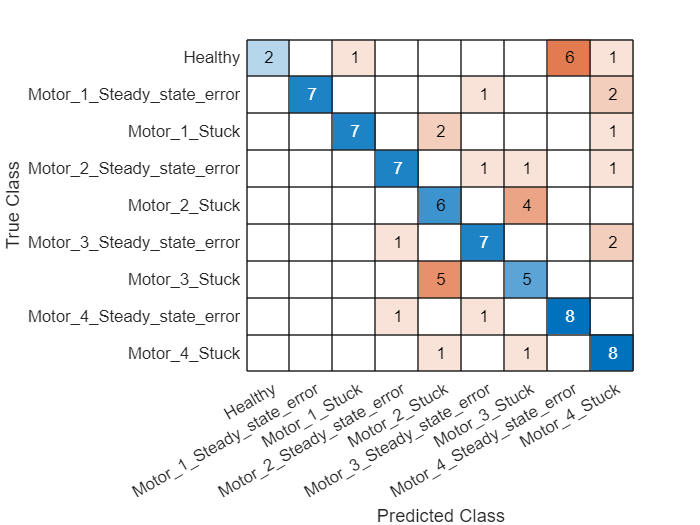

In this notebook, we train a fault diagnosis model based on the simulation data from the digital twin, and test the trained model on a real robot. 

**The source code can be found in: [scripts/trainSimTestReal.m](../scripts/trainSimTestReal.mlx).**

## Download the dataset

First, we download previously generated training (through simulation) and test (from a real robot) dataset. The dataset should be first downloaded and unzipped into a local subdirectory called `dataset`. In `dataset/`, you will find three subfolders:

   -  trainingDatasets: Contain the training data; 
   -  testDatasetsOriginal: Contain the test data in the original format collected from the robot 
   -  testDatasets: Contain the test data transformed into the Matlab format. 
   -  dataset_descrpitions.txt: Describe the settings for generating each training and test dataset. 

You can either download the dataset from [this link](https://nextcloud.centralesupelec.fr/s/7AR6aamBZNXcRM8/download). Then, you should unzip the downloaded file and put the folder `dataset` under the root dictionary. Or you can directly run this code to download the dataset. Depending on the network condition, it migth take up to 20 mins to download the dataset.

```matlab:Code
url = 'https://nextcloud.centralesupelec.fr/s/7AR6aamBZNXcRM8/download';
downloadFolder = fullfile('../', 'dataset');
rootDict = fullfile('../');
if ~exist(downloadFolder, 'dir')
    options = weboptions('Timeout', 30);
    loc = websave([downloadFolder '.zip'], url, options);
    unzip(loc, rootDict);
end
```

## Data preparation
### Load the training data

We load the original dataset in `trainingDataFolderName`, and create two cell arrays:

   -  dataTables: A cellarray of 3600 elements, each element is a dataTable, contains all the available features. 
   -  y: A cellarray of 3600 elements, each element is the label (str). 

Here, the training dataset used is `20141016. `

```matlab:Code
clear; clc; close all;
warning('off');

% Set random seed for reproduction purpose.
rng(42);

trainingDataFolderName = '20241016';
testDataFolderName = '20241016';
doTraining = true;

mdlName = ['mdlTrajCmdTrajResidual' 'TrData' trainingDataFolderName 'TestData' testDataFolderName '.mat'];
% Define the path to check for 'conc_dataset.mat'
pathLoggedTrainingData = ['../dataset/trainingDatasets/' trainingDataFolderName '/training_dataset.mat'];
pathTrainingData = ['../dataset/trainingDatasets/' trainingDataFolderName '/'];

% Define a DataLoader instance.
% Define the length of simulation and the corresponding sequence length.
lenSeries = 1000; % Sequence length.
simulationTime = 10; % The time that this sequence corresponds to.
dataLoader = DataLoader(lenSeries, simulationTime);
dataLoader.shuffle = false; % Shuffle the data.
dataLoader.pathTrainingDataset = pathTrainingData;
dataLoader.pathLoggedTrainingData = pathLoggedTrainingData;
[X, y] = dataLoader.loadTrainingData();
```

```text:Output
Loaded data from ../dataset/trainingDatasets/20241016/training_dataset.mat
```

We can print an example of all the features.

```matlab:Code
X{1}
```

| |Timestamps|Motor1Cmd|Motor2Cmd|Motor3Cmd|Motor4Cmd|Motor5Cmd|DesiredTrajectory-x|DesiredTrajectory-y|DesiredTrajectory-z|RealizedTrajectory-x|RealizedTrajectory-y|RealizedTrajectory-z|matFilePath|
|:--:|:--:|:--:|:--:|:--:|:--:|:--:|:--:|:--:|:--:|:--:|:--:|:--:|:--:|
|1|0|0|0|0|0|0|0|-0|0.3105|0|-0|0.3105|'..\\dataset\\traini...|
|2|0.0100|0.0168|-0.0141|-0.0001|-0.0006|0|-0.0001|0.0035|0.3105|0|-0|0.3105|'..\\dataset\\traini...|
|3|0.0200|0.0336|-0.0282|-0.0002|-0.0013|0|-0.0002|0.0070|0.3104|0|-0|0.3105|'..\\dataset\\traini...|
|4|0.0300|0.0504|-0.0423|-0.0003|-0.0019|0|-0.0005|0.0105|0.3103|0|-0|0.3105|'..\\dataset\\traini...|
|5|0.0400|0.0672|-0.0564|-0.0004|-0.0026|0|-0.0009|0.0140|0.3101|-0|0.0002|0.3105|'..\\dataset\\traini...|
|6|0.0500|0.0840|-0.0705|-0.0005|-0.0032|0|-0.0015|0.0175|0.3099|-0|0.0010|0.3105|'..\\dataset\\traini...|
|7|0.0600|0.1008|-0.0845|-0.0006|-0.0039|0|-0.0021|0.0209|0.3096|-0|0.0029|0.3105|'..\\dataset\\traini...|
|8|0.0700|0.1176|-0.0986|-0.0006|-0.0045|0|-0.0029|0.0244|0.3093|-0.0001|0.0056|0.3104|'..\\dataset\\traini...|
|9|0.0800|0.1344|-0.1127|-0.0007|-0.0052|0|-0.0038|0.0278|0.3089|-0.0004|0.0089|0.3103|'..\\dataset\\traini...|
|10|0.0900|0.1512|-0.1268|-0.0008|-0.0058|0|-0.0047|0.0312|0.3085|-0.0007|0.0126|0.3102|'..\\dataset\\traini...|
|11|0.1000|0.1680|-0.1409|-0.0009|-0.0064|0|-0.0058|0.0345|0.3080|-0.0013|0.0165|0.3100|'..\\dataset\\traini...|
|12|0.1100|0.1848|-0.1550|-0.0010|-0.0071|0|-0.0071|0.0378|0.3075|-0.0020|0.0204|0.3097|'..\\dataset\\traini...|
|13|0.1200|0.2015|-0.1691|-0.0011|-0.0077|0|-0.0084|0.0411|0.3069|-0.0028|0.0242|0.3093|'..\\dataset\\traini...|
|14|0.1300|0.2183|-0.1832|-0.0012|-0.0084|0|-0.0098|0.0443|0.3063|-0.0037|0.0280|0.3089|'..\\dataset\\traini...|

### Split into training and validation dataset.

Here, we split the training dataset into training and validation dataset using a training ratio of 90%.

```matlab:Code
% Shuffle the dataset using the cvpartition function
training_ratio = .9;
n_dataset = numel(X);
training_size = floor(training_ratio*n_dataset);
cvObj = cvpartition(y, 'HoldOut', training_size);
idx = cvObj.test;

% Split into training and test data based on training size specified
X_train = X(idx');
X_val = X(~idx');
y_train = categorical(y(idx'));
y_val = categorical(y(~idx'));
```

## Load the testing dataset.

Then, we load the testing data from the real robot.

```matlab:Code
dataLoader.pathLoggedTestData = ['../dataset/testDatasets/' testDataFolderName '/real_testing_dataset.mat'];
dataLoader.pathTestDataset = ['../dataset/testDatasets/' testDataFolderName '/'];
dataLoader.pathOriginalTestData = ['../dataset/testDatasetsOriginal/' testDataFolderName '/'];
dataLoader.nTrajPerLabelTestDataset = 10;
dataLoader.labelList = {'Healthy', ...
    'Motor_1_Stuck', 'Motor_2_Stuck', 'Motor_3_Stuck', 'Motor_4_Stuck', ...
    'Motor_1_Steady_state_error', 'Motor_2_Steady_state_error', 'Motor_3_Steady_state_error', 'Motor_4_Steady_state_error'};
    
[X_test, y_test] = dataLoader.loadTestingData();
```

```text:Output
Loaded data from ../dataset/testDatasets/20241016/real_testing_dataset.mat
```

```matlab:Code
y_test = categorical(y_test);
```

```matlab:Code
X_test{1}
```

| |Timestamps|Motor1Cmd|Motor2Cmd|Motor3Cmd|Motor4Cmd|Motor5Cmd|DesiredTrajectory-x|DesiredTrajectory-y|DesiredTrajectory-z|RealizedTrajectory-x|RealizedTrajectory-y|RealizedTrajectory-z|matFilePath|
|:--:|:--:|:--:|:--:|:--:|:--:|:--:|:--:|:--:|:--:|:--:|:--:|:--:|:--:|
|1|0|0.0084|0.0084|0.0042|0.0084|0.0042|0|-0.0031|0.3105|2.5919e-05|-0.0031|0.3105|'..\\dataset\\testDa...|
|2|0.0100|0.0084|0.0084|0.0042|0.0084|0.0042|0|-0.0031|0.3105|2.5858e-05|-0.0036|0.3105|'..\\dataset\\testDa...|
|3|0.0200|0.0084|0.0084|0.0042|0.0084|0.0042|0|-0.0031|0.3105|2.4455e-05|-0.0042|0.3105|'..\\dataset\\testDa...|
|4|0.0300|0.0084|0.0084|0.0042|0.0084|0.0042|0|-0.0031|0.3105|2.1713e-05|-0.0047|0.3105|'..\\dataset\\testDa...|
|5|0.0400|0.0061|0.0133|0.0044|0.0125|0.0042|0|-0.0046|0.3105|1.7629e-05|-0.0052|0.3104|'..\\dataset\\testDa...|
|6|0.0500|0.0015|0.0235|0.0048|0.0211|0.0041|0|-0.0076|0.3104|1.2206e-05|-0.0058|0.3104|'..\\dataset\\testDa...|
|7|0.0600|-0.0031|0.0337|0.0052|0.0296|0.0041|-0|-0.0106|0.3103|5.4419e-06|-0.0063|0.3104|'..\\dataset\\testDa...|
|8|0.0700|-0.0077|0.0439|0.0056|0.0382|0.0040|-0.0001|-0.0135|0.3101|-2.6619e-06|-0.0068|0.3104|'..\\dataset\\testDa...|
|9|0.0800|-0.0123|0.0541|0.0061|0.0467|0.0040|-0.0002|-0.0165|0.3099|-1.2105e-05|-0.0074|0.3104|'..\\dataset\\testDa...|
|10|0.0900|-0.0169|0.0643|0.0065|0.0553|0.0040|-0.0003|-0.0195|0.3097|-2.2888e-05|-0.0079|0.3104|'..\\dataset\\testDa...|
|11|0.1000|-0.0215|0.0745|0.0069|0.0638|0.0039|-0.0005|-0.0225|0.3094|-3.5010e-05|-0.0084|0.3103|'..\\dataset\\testDa...|
|12|0.1100|-0.0261|0.0847|0.0073|0.0724|0.0039|-0.0007|-0.0255|0.3091|-8.7771e-05|-0.0106|0.3102|'..\\dataset\\testDa...|
|13|0.1200|-0.0307|0.0949|0.0077|0.0809|0.0038|-0.0009|-0.0285|0.3087|-1.6056e-04|-0.0129|0.3101|'..\\dataset\\testDa...|
|14|0.1300|-0.0353|0.1051|0.0082|0.0895|0.0038|-0.0011|-0.0314|0.3083|-2.5228e-04|-0.0152|0.3100|'..\\dataset\\testDa...|

## Training and validation set creation

We randomly split a dataset and train a LSTM.

We can show the distribution of classes in the training and testing dataset, to make sure the seperation is fair.

```matlab:Code
summary(y_train);
```

```text:Output
     Healthy      Motor_1_Steady_state_error      Motor_1_Stuck      Motor_2_Steady_state_error      Motor_2_Stuck      Motor_3_Steady_state_error      Motor_3_Stuck      Motor_4_Steady_state_error      Motor_4_Stuck 
     360          360                             360                360                             360                360                             360                360                             360           
```

```matlab:Code
summary(y_val);
```

```text:Output
     Healthy      Motor_1_Steady_state_error      Motor_1_Stuck      Motor_2_Steady_state_error      Motor_2_Stuck      Motor_3_Steady_state_error      Motor_3_Stuck      Motor_4_Steady_state_error      Motor_4_Stuck 
     40           40                              40                 40                              40                 40                              40                 40                              40            
```

```matlab:Code
summary(y_test);
```

```text:Output
     Healthy      Motor_1_Steady_state_error      Motor_1_Stuck      Motor_2_Steady_state_error      Motor_2_Stuck      Motor_3_Steady_state_error      Motor_3_Stuck      Motor_4_Steady_state_error      Motor_4_Stuck 
     10           10                              10                 10                              10                 10                              10                 10                              10            
```

## Pre-processing and feature engineering

In this section, we preprocess the data and augument the dataset by adding some new features from feature engineering.

```matlab:Code
X_train = dataLoader.extractFeaturesTrajCmdTrajResidual(X_train);
X_val = dataLoader.extractFeaturesTrajCmdTrajResidual(X_val);
X_test = dataLoader.extractFeaturesTrajCmdTrajResidual(X_test);
```

Networks will often train better when normalized. Calculate the mean and standard deviation and normalize each element of the training feature set. 

```matlab:Code
[X_train, M, S] = normalize_features(X_train);
[X_val, ~, ~] = normalize_features(X_val, M, S);
[X_test, ~, ~] = normalize_features(X_test, M, S);
```

## Training and evaluating the model

Use an LSTM network. An LSTM layer learns long-term dependencies between time steps of time series or sequence data. The first lstmlayer will have 100 hidden units and output the sequence data. Then a dropout layer will be used to reduce probability of overfitting. The second lstmlayer will output just the last step of the time sequence.

```matlab:Code
layers = [ ...
    sequenceInputLayer(size(X_train{1},1))
    lstmLayer(100,"OutputMode","sequence")
    dropoutLayer(0.1)
    lstmLayer(100,"OutputMode","last")
    fullyConnectedLayer(numel(categories(y_train)))
    softmaxLayer
    classificationLayer];
```

### Define Network Hyperparameters

```matlab:Code
miniBatchSize = 32;
validationFrequency = floor(numel(X_train)/miniBatchSize);
options = trainingOptions("adam", ...
    "MaxEpochs",30, ...
    "MiniBatchSize",miniBatchSize, ...
    "Plots","training-progress", ...
    "Verbose",false, ...
    "Shuffle","every-epoch", ...
    "LearnRateSchedule","piecewise", ...
    "LearnRateDropFactor",0.1, ...
    "LearnRateDropPeriod",20,...
    'ValidationData',{X_val, y_val}, ...
    'ValidationFrequency',validationFrequency);
```

### Train The Network

This network takes about 100 seconds to train on an NVIDIA RTX 2080 GPU.

```matlab:Code
if doTraining || ~isfile(mdlName)
    diagnosisNet = trainNetwork(X_train, y_train, layers, options);
    save(mdlName, 'diagnosisNet');
else
    load(mdlName, 'diagnosisNet');
end
```

### Test The Network

Now that the network has been trained, we can test it on the validation data. 

```matlab:Code
y_pred = classify(diagnosisNet, X_test);
```

View the confusion chart for the test results:

```matlab:Code
figure()
cm = confusionchart(y_test', y_pred);
```



View the overall accuracy percentage of the validation and test results:

```matlab:Code
[accuracy, precision, recall, f1Score] = dataLoader.evalPerf(y_test, y_pred);
% Display the results
fprintf('Overall Accuracy: %.2f%%\n', accuracy * 100);
```

```text:Output
Overall Accuracy: 63.33%
```

```matlab:Code
class_names = categories(y_test);
for i = 1:numel(class_names)
    fprintf('Class %d (%s): Precision = %.2f, Recall = %.2f, F1 Score = %.2f\n', i, class_names{i}, precision(i), recall(i), f1Score(i));
end
```

```text:Output
Class 1 (Healthy): Precision = 1.00, Recall = 0.20, F1 Score = 0.33
Class 2 (Motor_1_Steady_state_error): Precision = 1.00, Recall = 0.70, F1 Score = 0.82
Class 3 (Motor_1_Stuck): Precision = 0.88, Recall = 0.70, F1 Score = 0.78
Class 4 (Motor_2_Steady_state_error): Precision = 0.78, Recall = 0.70, F1 Score = 0.74
Class 5 (Motor_2_Stuck): Precision = 0.43, Recall = 0.60, F1 Score = 0.50
Class 6 (Motor_3_Steady_state_error): Precision = 0.70, Recall = 0.70, F1 Score = 0.70
Class 7 (Motor_3_Stuck): Precision = 0.45, Recall = 0.50, F1 Score = 0.48
Class 8 (Motor_4_Steady_state_error): Precision = 0.57, Recall = 0.80, F1 Score = 0.67
Class 9 (Motor_4_Stuck): Precision = 0.53, Recall = 0.80, F1 Score = 0.64
```

# Discussions

When applied to real data, we can see a signifiant drop of model performance. The most severely impacted class is the normal class: Most of the normal samples are misclassifed to the otehr failure classes. This is mainly because in the real robot, there are errors caused by noise. So even for normal data without failure, the residual values tend to be larger than the simulation data. More generally, the feature distribution is different between the training data and the test data. 
